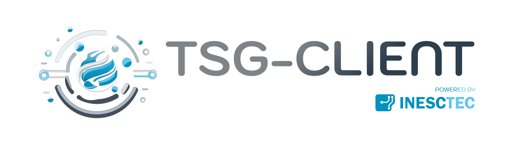

.. TSG Client documentation master file, created by
   sphinx-quickstart on Tue Jan 23 12:14:42 2024.
   You can adapt this file completely to your liking, but it should at least
   contain the root `toctree` directive.

Welcome to TSG Client's documentation!
======================================

TSG Client is a Python library for interacting with the TNO Security Gateway (TSG). It is current version, it is a simple REST API client that interacts with TSG Core Connector APIs and TSG OpenAPI Data APP. It provides a simple and easy-to-use interface for tasks such as:

 - Connecting to a TSG core container (via API KEY)
 - Retrieving connector self-descriptions
 - Parsing / filtering connector catalogs and artifacts, retrieved from self-descriptions
 - Requesting and consuming data artifacts (via dataspace)
 - Queries to the dataspace Metadata Broker to list registered connectors and respective self-descriptions
 - Perform requests via OpenAPI Data APP

This document provides detailed instructions for setting up the INESC TEC Client for TNO Security Gateway (TSG-Client) environment. Please follow these steps carefully to ensure successful configuration and deployment.

.. toctree::
   :maxdepth: 2
   :caption: Contents:

   getting_started
   faq
   contacts

.. toctree::
    :maxdepth: 3
    :caption: Code Examples:

    Examples <examples>

Indices and tables
==================

* :ref:`genindex`
* :ref:`modindex`
* :ref:`search`
